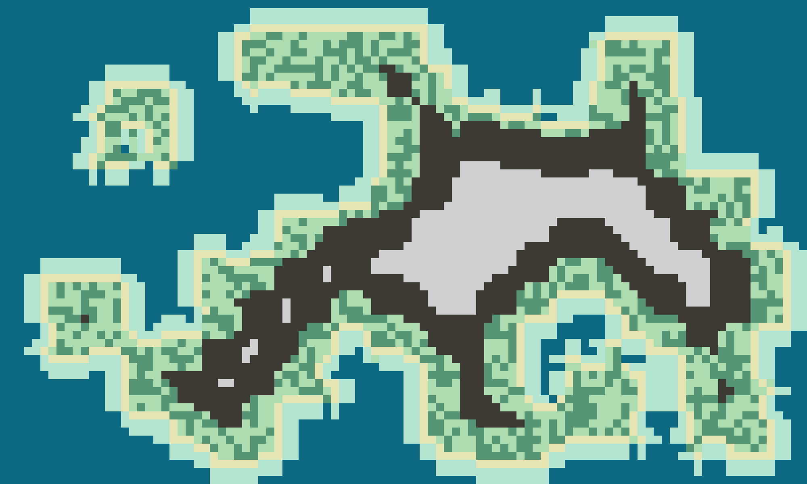
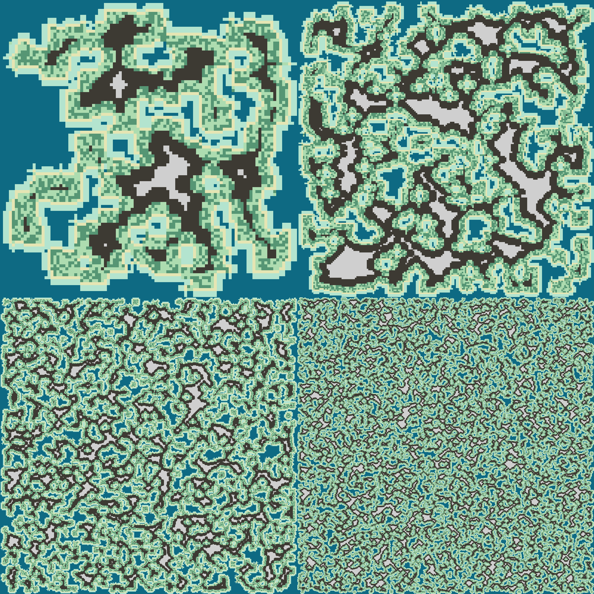

# Cpp_MapGenerator

<i>This is a C++ map generator without using any kind of noise</i>

### The final standard result looks like this:

### Changing the parameters different results can be achieved (exemples just changing size):

